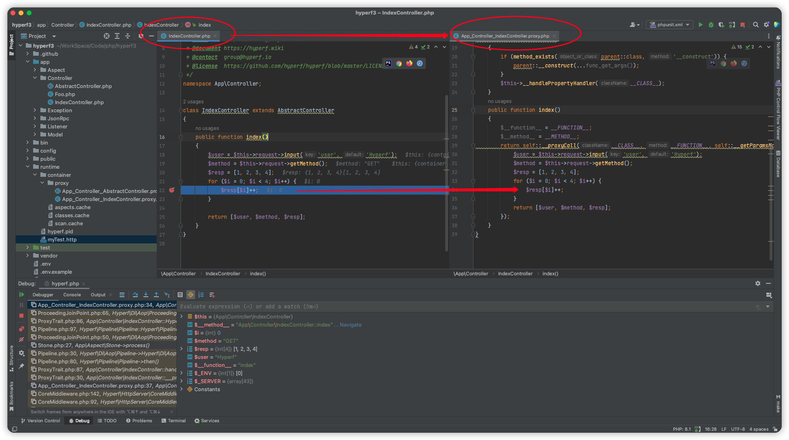

IntelliJ IDEA / PhpStorm Hyperf Plugin
========================

| Key        | Value                                     |
|------------|-------------------------------------------|
| Plugin Url | https://plugins.jetbrains.com/plugin/23007 |
| ID         | `io.maliboot.www.hyperf`                  |
| Changelog  | [CHANGELOG](CHANGELOG.md)                 |

About
---------------------
这是一个对`hyperf`框架/组件、或者依赖`hyperf`组件基础上编写的第三方扩展提供功能支持的`Phpstorm`插件。

Install
---------------------
* 通过插件市场安装 [Hyperf Support](https://plugins.jetbrains.com/plugin/23007) `Settings -> Plugins -> Browse repositories`
* 通过本地磁盘安装 [Hyperf Support](https://github.com/maliboot/idea-hyperf-plugin/releases) `Settings -> Plugins -> Install Plugin from Disk...`，插件jar包可以在release页面找到

Feature
---------------------
* 
* Debug调试
  * 问题背景：hyperf的AOP会生成编译生成代理文件，如`app/IndexController.php`会生成`./runtime/container/proxy/APP_IndexController.proxy.php`代理文件。当程序启动时，`IndexController.php`变成了模板文件不再参与程序运行，`APP_IndexController.proxy.php`成为了实际上真正运行的文件，所以当debug调试程序时所有的`断点`和`堆栈列表日志`都追溯到了代理文件内。
  * 解决方案：定位`模板文件`或`代理文件`的断点所在行第一个`ast节点`，计算出该节点的树路径相对偏移量，得出对应文件的断点位置
* Lombok支持（Todo）：[maliboot/lombok](https://github.com/maliboot/lombok)适配，解决该PHP扩展使用时编辑器没有自动补全、参数提示、错误语法高量、导航等功能

Idea
---------------------

* 欢迎给我提功能建议👏，如果戳中了需求痛点，我会抽时间来开发。[点这里提需求](https://github.com/maliboot/idea-hyperf-plugin/issues/new?title=%E3%80%90%E5%8A%9F%E8%83%BD%E5%BB%BA%E8%AE%AE%E3%80%91XXX&body=...)