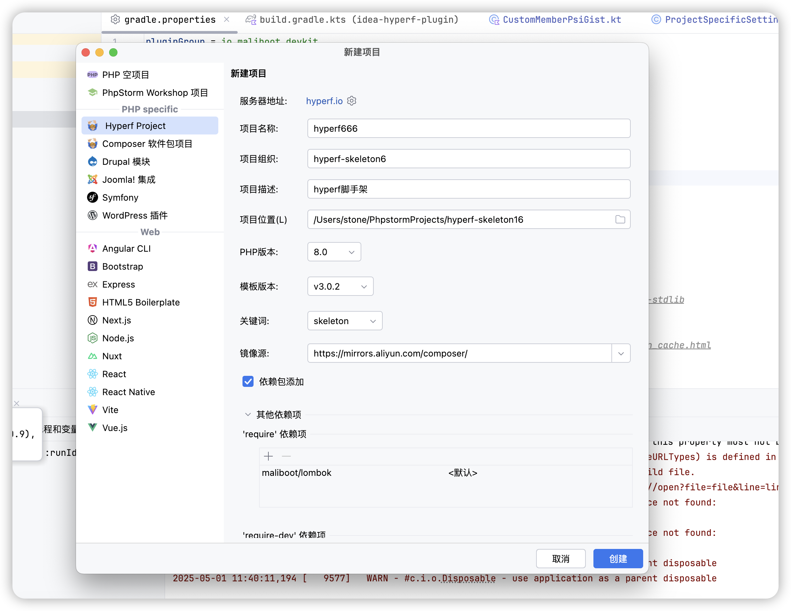
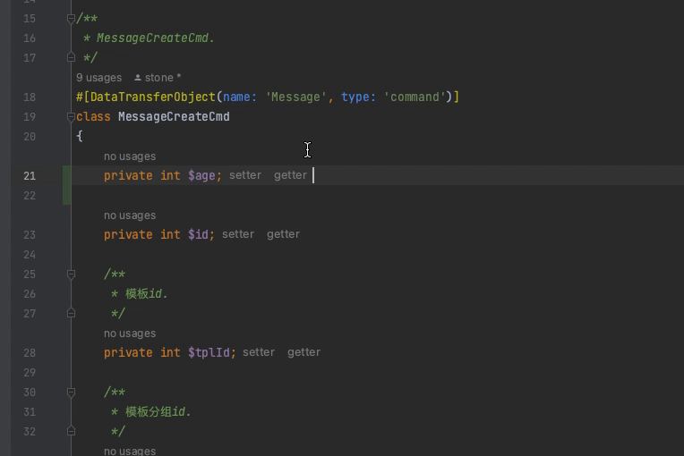

IntelliJ IDEA / PhpStorm Hyperf Plugin
========================

| Key        | Value                                     |
|------------|-------------------------------------------|
| Plugin Url | https://plugins.jetbrains.com/plugin/23164 |
| ID         | `io.maliboot.www.hyperf`                  |
| Changelog  | [CHANGELOG](CHANGELOG.md)                 |
<!-- Plugin description -->
# About
This is a PHPStorm plugin that provides support for the hyperf framework/component or third-party vendor extensions dependent on hyperf components.

# 简介
这是一个对`hyperf`框架/组件、或者依赖`hyperf组件`的第三方`vendor`扩展包，提供功能支持的`PHPStorm`插件。

[功能介绍传送门](https://github.com/maliboot/idea-hyperf-plugin/blob/master/README.md)
<!-- Plugin description end -->

# Install
* 通过插件市场安装 [Hyperf Booster](https://plugins.jetbrains.com/plugin/23164) `Settings -> Plugins -> Browse repositories`
* 通过本地磁盘安装 [Hyperf Booster](https://github.com/maliboot/idea-hyperf-plugin/releases) `Settings -> Plugins -> Install Plugin from Disk...`，插件jar包可以在[release](https://github.com/maliboot/idea-hyperf-plugin/releases)页面找到
* 预览版本只能通过[release](https://github.com/maliboot/idea-hyperf-plugin/releases)页面安装，里面包含了一些正在测试中的功能

# Feature
## 基础适配
* 重复类声明：当AOP类产生代理文件，屏蔽重复类声明的异常报错。如`App_User.proxy.php 处存在类 'User' 的其他声明`错误将不再显示
* 拼写检查：屏蔽框架常用词如`hyperf`、`swoole`、`jsonrpc`等等单词的拼写错误警告。如有遗漏或补充，请提交Issue给我。

## 项目创建向导

* 支持像创建`Symfony`项目一样，创建`Hyperf`项目。
* 提供多版本的`Hyperf`骨架版本选择

## debug
`swoole`官网提到，在版本`5.1`以上支持了`xdebug`调试，所以做了这样一个功能。此功能主要是为了解决`Hyperf`调试时，断点跳到代理文件内的问题。
> 调试准备，php.ini中修改: 
> 
> swoole.enable_fiber_mock=On

本插件会定位`模板文件`或`代理文件`的断点所在行第一个`ast节点`，计算出该节点的树路径相对偏移量，得出对应文件的断点位置，尽可能让`hyperf`得以在`模板文件`内调试

>>> hyperf的AOP会生成编译生成代理文件，如`app/IndexController.php`会生成`./runtime/container/proxy/APP_IndexController.proxy.php`代理文件。当程序启动时，`IndexController.php`变成了模板文件不再参与程序运行，`APP_IndexController.proxy.php`成为了实际上真正运行的文件，所以当debug调试程序时所有的`断点`和`堆栈列表日志`都追溯到了代理文件内。

## Lombok‼️（**该功能完全不依赖`代理文件`**）

* Lombok支持：[maliboot/lombok](https://github.com/maliboot/lombok)适配，解决该PHP扩展使用时编辑器没有自动补全、参数提示、错误语法高量、导航等功能。
* **该功能完全不依赖`代理文件`**。通过构建了相应的`FakePhpPsiElement`元素, 旨在极端情况下（如项目没有热启动，无法更新代理文件时），提供对[maliboot/lombok](https://github.com/maliboot/lombok)的全方位支持

# Idea
* 如果使用插件过程中有报错，可以[提交堆栈报告](https://github.com/maliboot/idea-hyperf-plugin/issues/new?title=[BUG]XXX主题&body=...)给我。这对我非常重要，我会及时修复
* 欢迎给我提功能建议👏，如果戳中了需求痛点，我会抽时间来开发。因为到目前为止，我也不知道写啥功能。[点这里提需求](https://github.com/maliboot/idea-hyperf-plugin/issues/new?title=%E3%80%90%E5%8A%9F%E8%83%BD%E5%BB%BA%E8%AE%AE%E3%80%91XXX&body=...)